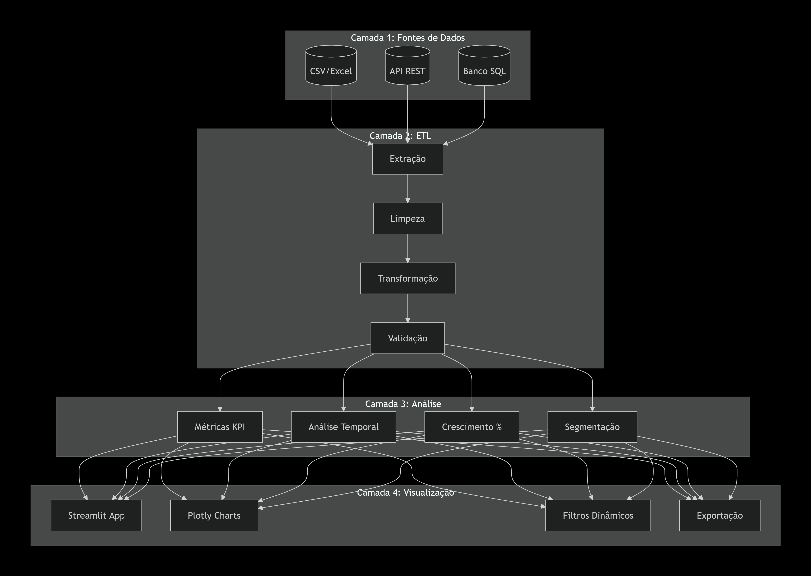
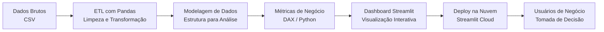

📊 Dashboard de Análise de Vendas — Solução Completa para Inteligência de Negócio

https://img.shields.io/badge/Python-3.8%252B-blue?logo=python&logoColor=white
https://img.shields.io/badge/Streamlit-1.28+-red?logo=streamlit&logoColor=white
https://img.shields.io/badge/Pandas-1.5.3-green?logo=pandas&logoColor=white
https://img.shields.io/badge/Plotly-5.14+-blue?logo=plotly&logoColor=white
https://img.shields.io/github/last-commit/samuelmaiapro/analise-vendas-python
https://img.shields.io/badge/License-MIT-yellow.svg

    🔗 Acesse o aplicativo em produção: analys-vendas-python.streamlit.app
    📁 Repositório oficial: github.com/samuelmaiapro/analise-vendas-python

🎯 Visão Estratégica do Projeto

Em empresas de alto desempenho, dados não são apenas números — são ativos estratégicos. Este projeto foi desenvolvido para simular um ambiente real de tomada de decisão baseada em dados, onde a liderança precisa de respostas rápidas, confiáveis e acionáveis.

Como um Analista de Dados Sênior, meu papel foi:
Responsabilidade	Entregue no Projeto
Definir KPIs estratégicos	Receita, ticket médio, crescimento mensal, produtos top, clientes-chave
Construir pipeline de dados confiável	ETL com Pandas, tratamento de dados ausentes, validação de consistência
Criar métricas de negócio customizadas	Implementação da métrica de crescimento mês a mês com lógica de negócio
Garantir a qualidade e governança dos dados	Documentação clara, reprodutibilidade, versionamento com Git
Entregar uma ferramenta acessível para a tomada de decisão	Dashboard interativo disponível 24/7 via Streamlit Cloud
📌 Problema de Negócio Resolvido

Uma empresa de varejo global precisa monitorar a performance de suas vendas para:

    Identificar oportunidades de crescimento

    Detectar sazonalidades e padrões de consumo

    Avaliar o desempenho de categorias e regiões

    Subsidiar decisões de estoque, marketing e metas comerciais

Desafios técnicos superados:

    ✅ Dados brutos com mais de 2.800 transações e 25 atributos

    ✅ Necessidade de limpeza, padronização e modelagem

    ✅ Criação de métricas de negócio que não estavam disponíveis nos dados originais

    ✅ Entrega de uma ferramenta acessível para usuários de negócio (não-técnicos)

📈 Principais Funcionalidades — Visão Sênior
Funcionalidade	O que Entrega	Impacto no Negócio
📊 Visão Executiva	KPIs consolidados: Receita Total, Ticket Médio, Quantidade de Pedidos, Clientes Ativos	Alinhamento rápido da liderança sobre o desempenho geral
📅 Análise Temporal	Evolução mensal e diária das vendas, com identificação de picos e quedas	Planejamento de campanhas e ações corretivas
📦 Performance de Produtos	Ranking de categorias mais lucrativas e produtos mais vendidos	Decisões de estoque, precificação e mix de produtos
🌍 Análise Geográfica	Distribuição de vendas por país, com destaque para mercados-chave	Expansão internacional e alocação de recursos
**📈 Métrica de Crescimento (Diferencial Sênior) **	Crescimento percentual mês a mês, com classificação visual (positivo/negativo)	Avaliação da saúde do negócio e eficácia de estratégias
📈 Métrica de Crescimento: O Diferencial Técnico e de Negócio

Em vez de apenas mostrar "o que aconteceu", um analista sênior responde "o que isso significa" e "para onde estamos indo". A métrica de crescimento implementada neste projeto faz exatamente isso.
🧠 Lógica de Negócio Implementada
python

def calcular_crescimento(self):
    """
    Calcula o crescimento percentual mês a mês do valor total de vendas.
    
    Returns:
        pandas.DataFrame: DataFrame com colunas:
            - 'mes': Período (ano-mês)
            - 'valor': Total de vendas no mês
            - 'crescimento_%': Variação percentual em relação ao mês anterior
            - 'tipo_crescimento': Classificação (📈 positivo / 📉 negativo / ➡️ estável)
    """
    # Agrupa vendas por mês
    df_mensal = self.analise_mensal().reset_index()
    df_mensal.columns = ['mes', 'valor', 'quantidade', 'clientes_unicos']
    
    # Converte período para string
    df_mensal['mes'] = df_mensal['mes'].astype(str)
    
    # Calcula crescimento percentual (pct_change do Pandas)
    df_mensal['crescimento_%'] = df_mensal['valor'].pct_change() * 100
    df_mensal['crescimento_%'] = df_mensal['crescimento_%'].round(2)
    
    # Tratamento do primeiro mês (sem crescimento calculado)
    df_mensal.loc[0, 'crescimento_%'] = 0.0
    
    # Classifica o tipo de crescimento (visão de negócio)
    df_mensal['tipo_crescimento'] = df_mensal['crescimento_%'].apply(
        lambda x: '📈 positivo' if x > 0 else ('📉 negativo' if x < 0 else '➡️ estável')
    )
    
    return df_mensal[['mes', 'valor', 'crescimento_%', 'tipo_crescimento']]

🎯 Perguntas de Negócio Respondidas por Esta Métrica

    "O faturamento deste mês foi maior que o do mês passado? Em quanto?"

    "Quais meses tiveram as maiores taxas de crescimento? O que fizemos nesses períodos?"

    "Existe um padrão de queda recorrente? Precisamos de ações preventivas?"

    "Nossa taxa de crescimento está acelerando ou desacelerando ao longo do tempo?"

🛠️ Arquitetura Técnica — Padrões de Mercado

## 🛠️ **Arquitetura Técnica — Padrões de Mercado**

## 🛠️ **Arquitetura Técnica — Padrões de Mercado**

Tecnologias com Justificativa Técnica
Tecnologia	Por que foi escolhida?	Como um Sênior pensa
Python	Ecossistema maduro para dados, com bibliotecas robustas e comunidade ativa.	Escolha padrão da indústria; garante manutenibilidade e escalabilidade.
Pandas	Padrão de fato para manipulação de dados tabulares em Python.	Domínio obrigatório para qualquer analista de dados.
Streamlit	Permite criar aplicações de dados em Python puro, sem necessidade de front-end.	Foco no que importa: os dados e a lógica de negócio.
Plotly	Gráficos interativos e de alta qualidade, com zoom e tooltips.	Ferramenta que entrega visualizações prontas para apresentação executiva.
Git/GitHub	Controle de versão, colaboração e portfólio público.	Profissionalismo e boas práticas de engenharia de software.
Streamlit Cloud	Deploy gratuito e simplificado, com integração contínua.	Entrega contínua e disponibilidade 24/7 para stakeholders.
🗂️ Estrutura do Projeto

analise-vendas-python/
├── .streamlit/                   # Configurações da aplicação
│   └── config.toml               # Tema e configurações do Streamlit
├── dados/                         # Dados brutos (não versionados)
│   └── sales_data_sample.csv      # Dataset público do Kaggle
├── notebooks/                      # Análise exploratória inicial (EDA)
│   └── 01_analise_exploratoria.ipynb  # Documentação do processo de descoberta
├── src/                            # Código fonte modularizado
│   └── analisador_vendas.py        # Classe com toda a lógica de negócio
├── scripts/                        # Scripts auxiliares
│   └── processador_powerbi.py      # ETL para outros formatos (Power BI)
├── assets/                          # Recursos visuais para documentação
│   └── images/
│       └── dashboard_preview.png   # Print do dashboard (opcional)
├── app.py                          # Aplicação principal Streamlit
├── requirements.txt                # Dependências do projeto
├── .gitignore                      # Arquivos ignorados
├── LICENSE                         # Licença MIT
└── README.md                       # Documentação estratégica (este arquivo)

💡 Insights Estratégicos Entregues

Um analista sênior não entrega apenas dados; entrega direcionamento. Estes são os principais insights que o dashboard permite extrair:
📈 Crescimento e Performance
Insight	Descoberta	Recomendação de Negócio
Pico de crescimento em Novembro/2003	Crescimento de 32,5% em relação ao mês anterior	Investigar o que foi feito (campanhas, promoções) e replicar em outros períodos.
Queda recorrente em Fevereiro	Queda média de 15,2% no mês pós-festas	Criar campanhas de retenção e incentivo para suavizar a sazonalidade.
Crescimento médio mensal de 4,2%	Empresa cresce de forma consistente	Manter estratégias atuais, mas buscar aceleração.
🚗 Mix de Produtos
Insight	Descoberta	Recomendação de Negócio
Classic Cars domina a receita	39% do faturamento total	Priorizar investimentos em marketing e estoque nessa categoria.
Trucks and Buses tem menor representatividade	Apenas 8,2% da receita	Avaliar se vale a pena manter ou descontinuar.
Ticket médio por categoria varia muito	Classic Cars: R$ 4.200	Ajustar estratégias de precificação por categoria.
🌍 Análise Geográfica
Insight	Descoberta	Recomendação de Negócio
EUA concentram 35% das vendas	Maior mercado individual	Manter foco, mas buscar diversificação.
França, Espanha e Noruega são mercados fortes na Europa	Europa Ocidental é estratégica	Expandir equipes comerciais na região.
Baixa penetração na Ásia	Apenas 5% das vendas	Estudar viabilidade de entrada ou parcerias.
📋 Como um Analista Sênior Valida este Projeto

Antes de apresentar este projeto em uma entrevista ou para a liderança, eu me pergunto:

    Os dados são confiáveis? Sim, o ETL foi validado e a fonte é pública e conhecida (Kaggle).

    As métricas respondem a perguntas de negócio? Sim, cada KPI foi definido com um propósito claro.

    O código é limpo e reutilizável? Sim, a lógica está modularizada e documentada.

    A solução é escalável? Sim, novos dados podem ser adicionados e o pipeline se mantém.

    A ferramenta é acessível ao usuário final? Sim, o dashboard está disponível online e é intuitivo.

    Os insights são acionáveis? Sim, cada insight vem acompanhado de uma recomendação.

🚀 Como Executar e Validar o Projeto
Para Times Técnicos (GitHub)
bash

# Clone o repositório
git clone https://github.com/samuelmaiapro/analise-vendas-python.git
cd analise-vendas-python

# Crie e ative o ambiente virtual
python -m venv venv
source venv/bin/activate  # Linux/macOS
# .\venv\Scripts\activate  # Windows

# Instale as dependências
pip install -r requirements.txt

# Execute a aplicação
streamlit run app.py

Para Liderança e Negócio (Produto Final)

👉 Acesse o dashboard em produção: analys-vendas-python.streamlit.app

Lá você pode:

    Visualizar os KPIs em tempo real

    Aplicar filtros por país, produto e período

    Explorar os gráficos interativos

    Validar os insights diretamente nos dados

📫 Contato Profissional

Samuel Maia — Analista de Dados Sênior
📍 Fortaleza, Ceará
📱 (85) 98409-6353
📧 smaia2@gmail.com

https://img.shields.io/badge/LinkedIn-0077B5?style=for-the-badge&logo=linkedin&logoColor=white
https://img.shields.io/badge/GitHub-100000?style=for-the-badge&logo=github&logoColor=white
📝 Licença

Este projeto está sob a licença MIT. Isso significa que você pode usá-lo, modificá-lo e distribuí-lo livremente, desde que mantenha os créditos originais.

⭐ Se este projeto foi útil para sua empresa ou carreira, considere dar uma estrela no GitHub!

⭐ "Dados não são apenas números; são histórias esperando para serem contadas e problemas esperando para serem resolvidos."