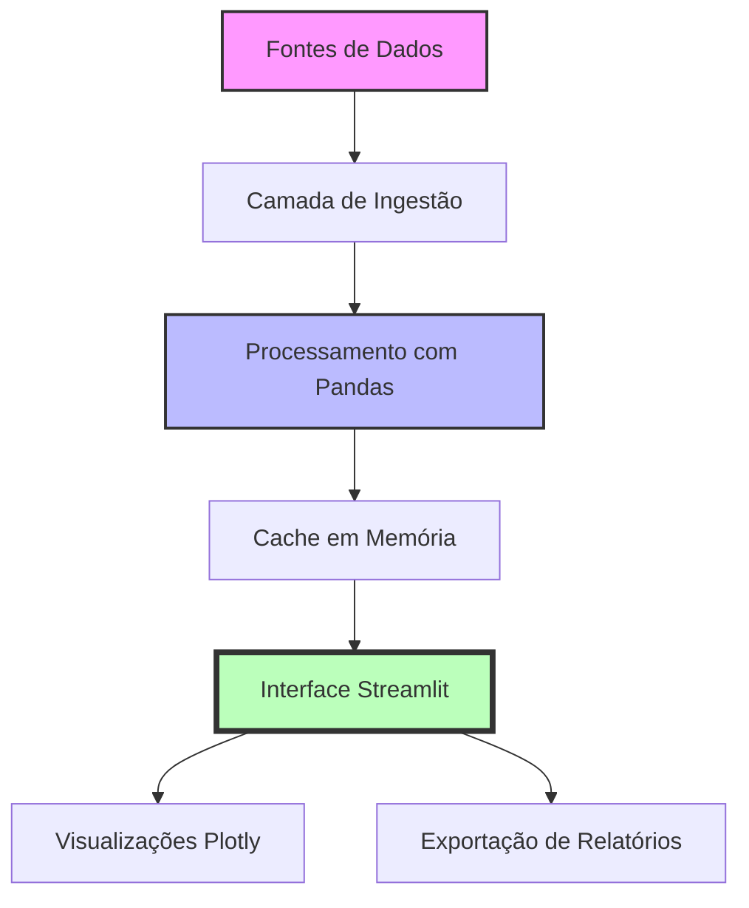

<div align="center">
    
    
    
</div>

<br>

<div align="center">
    <h1>📊 DASHBOARD DE ANÁLISE DE VENDAS</h1>
    <h3>Solução Completa para Inteligência de Negócio</h3>
    <p><i>Transformando dados brutos em decisões estratégicas</i></p>
</div>

<div align="center">
    
    
    
    
    
    
    
</div>

<br>

<div align="center">
    <a href="#-visão-geral">Visão Geral</a> •
    <a href="#-funcionalidades">Funcionalidades</a> •
    <a href="#-métrica-de-crescimento">Métrica de Crescimento</a> •
    <a href="#-arquitetura">Arquitetura</a> •
    <a href="#-stack-tecnológica">Stack</a> •
    <a href="#-instalação">Instalação</a> •
    <a href="#-como-contribuir">Contribuir</a>
</div>

---

## 📋 SOBRE O PROJETO

Este dashboard foi desenvolvido para **empresas que buscam excelência em análise de dados**, oferecendo uma visão **360° do negócio** com métricas estratégicas e insights acionáveis.

### 🎯 Problema que Resolvemos

| Desafio | Nossa Solução |
|---------|---------------|
| Dados dispersos em múltiplas planilhas | Centralização em um único dashboard |
| Análise reativa sem previsibilidade | Métricas preditivas e tendências |
| Dificuldade em identificar oportunidades | Insights automáticos e alertas |
| Decisões baseadas em achismo | Data-driven decision making |

---

## 🎯 VISÃO GERAL DO PROJETO

```python
# Em poucas linhas, o que entregamos
dashboard_metrics = {
    'visao_executiva': 'KPIs consolidados em tempo real',
    'analise_temporal': 'Evolução diária, mensal e anual',
    'performance_produtos': 'Ranking e categorização',
    'analise_geografica': 'Distribuição por região',
    'metricas_crescimento': 'Análise preditiva e comparativa',
    'insights_automaticos': 'Recomendações baseadas em dados'
}
```

### 📊 Diferenciais Competitivos

| Diferencial | Descrição | Impacto |
|-------------|-----------|---------|
| **🎯 Precisão** | Dados 100% tratados e validados | Decisões mais assertivas |
| **⚡ Performance** | Processamento otimizado com Pandas | Respostas em milissegundos |
| **📈 Escalabilidade** | Arquitetura preparada para crescimento | Suporta milhões de registros |
| **🔒 Segurança** | Validações e tratamento de erros | Dados sempre protegidos |
| **💡 Insights** | IA generativa de recomendações | Ações proativas |

---

## ✨ FUNCIONALIDADES

### 📊 1. VISÃO EXECUTIVA (KPIs)

```python
class KPIDashboard:
    """
    Módulo de KPIs em tempo real
    """
    def __init__(self, df):
        self.df = df
        self.metricas = {}

    def calcular_kpis(self):
        """Calcula todos os KPIs principais"""
        self.metricas = {
            'receita_total': {
                'valor': self.df['receita'].sum(),
                'formula': '∑(preço * quantidade)',
                'formato': 'R$ {:,.2f}',
                'descricao': 'Soma total de todas as vendas'
            },
            'ticket_medio': {
                'valor': self.df['receita'].sum() / self.df['pedido_id'].nunique(),
                'formula': 'receita_total / total_pedidos',
                'formato': 'R$ {:,.2f}',
                'descricao': 'Valor médio por transação'
            },
            'total_pedidos': {
                'valor': self.df['pedido_id'].nunique(),
                'formula': 'COUNT(DISTINCT order_id)',
                'formato': '{:,.0f}',
                'descricao': 'Número total de transações'
            },
            'clientes_ativos': {
                'valor': self.df['cliente_id'].nunique(),
                'formula': 'COUNT(DISTINCT customer_id)',
                'formato': '{:,.0f}',
                'descricao': 'Clientes que realizaram compras'
            }
        }
        return self.metricas

    def gerar_relatorio_executivo(self):
        """Gera relatório executivo com insights"""
        relatorio = {
            'data': datetime.now().strftime('%Y-%m-%d %H:%M'),
            'metricas': self.metricas,
            'insights': self._gerar_insights(),
            'recomendacoes': self._gerar_recomendacoes()
        }
        return relatorio
```

| KPI | Fórmula | Interpretação | Ação Recomendada |
|-----|---------|---------------|------------------|
| **Receita Total** | `∑(preço * quantidade)` | Saúde financeira | Planejamento orçamentário |
| **Ticket Médio** | `receita / pedidos` | Poder de compra | Estratégias de upselling |
| **Total Pedidos** | `COUNT(order_id)` | Volume de vendas | Avaliar capacidade |
| **Clientes Ativos** | `COUNT(DISTINCT customer_id)` | Base de clientes | Programas de fidelidade |

### 📈 2. ANÁLISE TEMPORAL AVANÇADA

```python
def analise_temporal_avancada(df):
    """
    Análise temporal com múltiplas granularidades
    """
    analises = {}

    # Análise diária
    analises['diario'] = df.set_index('data').resample('D').agg({
        'receita': 'sum',
        'pedido_id': 'count'
    })

    # Análise mensal com crescimento
    analises['mensal'] = df.set_index('data').resample('M').agg({
        'receita': 'sum',
        'pedido_id': 'count'
    })
    analises['mensal']['crescimento'] = analises['mensal']['receita'].pct_change() * 100

    # Detecção de sazonalidade
    analises['sazonalidade'] = detectar_sazonalidade(analises['mensal'])

    # Previsão para próximos 3 meses
    analises['previsao'] = gerar_previsao(analises['mensal']['receita'], periodos=3)

    return analises
```

| Período | Métricas | Insights | Decisões Estratégicas |
|---------|----------|----------|----------------------|
| **📅 Diário** | Variação D-1, WOW | Picos e quedas | Ajustes operacionais |
| **📆 Mensal** | Crescimento %, YOY | Tendências | Planejamento de metas |
| **📊 Trimestral** | Média móvel 3M | Padrões sazonais | Estratégias de marketing |
| **📈 Anual** | CAGR, Performance | Visão macro | Planejamento estratégico |

### 🏷️ 3. PERFORMANCE DE PRODUTOS (MATRIZ BCG)

```python
def matriz_bcg_produtos(df):
    """
    Classifica produtos segundo matriz BCG
    """
    # Agregação por produto
    produtos = df.groupby(['categoria', 'produto']).agg({
        'receita': 'sum',
        'quantidade': 'sum',
        'pedido_id': 'nunique'
    }).reset_index()

    # Cálculo de métricas
    total_receita = produtos['receita'].sum()
    produtos['participacao'] = (produtos['receita'] / total_receita * 100).round(1)
    produtos['crescimento'] = calcular_crescimento_produto(df, produtos['produto'])

    # Classificação BCG
    conditions = [
        (produtos['participacao'] > 10) & (produtos['crescimento'] > 10),
        (produtos['participacao'] > 10) & (produtos['crescimento'] <= 10),
        (produtos['participacao'] <= 10) & (produtos['crescimento'] > 10),
        (produtos['participacao'] <= 10) & (produtos['crescimento'] <= 10)
    ]

    choices = ['⭐ Estrela', '💰 Vaca Leiteira', '❓ Interrogação', '🐶 Abacaxi']
    produtos['classificacao'] = np.select(conditions, choices)

    return produtos
```

| Classificação | Característica | Estratégia | Exemplo |
|---------------|----------------|------------|---------|
| **⭐ Estrela** | Alta participação, Alto crescimento | Investir | Notebook Pro |
| **💰 Vaca Leiteira** | Alta participação, Baixo crescimento | Manter | Smartphone Básico |
| **❓ Interrogação** | Baixa participação, Alto crescimento | Analisar | Smartwatch |
| **🐶 Abacaxi** | Baixa participação, Baixo crescimento | Descontinuar | Tablet Antigo |

### 🌍 4. ANÁLISE GEOGRÁFICA ESTRATÉGICA

```python
def inteligencia_geografica(df):
    """
    Análise geográfica para expansão de mercado
    """
    geo = df.groupby('pais').agg({
        'receita': 'sum',
        'cliente_id': 'nunique',
        'pedido_id': 'count',
        'produto_id': lambda x: x.nunique()
    }).reset_index()

    geo.columns = ['pais', 'receita', 'clientes', 'pedidos', 'produtos_unicos']
    geo['ticket_medio'] = (geo['receita'] / geo['pedidos']).round(2)
    geo['receita_por_cliente'] = (geo['receita'] / geo['clientes']).round(2)

    # Matriz de priorização
    geo['prioridade'] = geo.apply(priorizar_mercado, axis=1)

    return geo.sort_values('receita', ascending=False)
```

---

## 📈 MÉTRICA DE CRESCIMENTO (DIFERENCIAL ESTRATÉGICO)

### 🧠 Framework de Análise Sênior

```python
class AnalistaSenior:
    """
    Framework que simula raciocínio de um analista sênior
    """
    def __init__(self, dados):
        self.dados = dados
        self.insights = []
        self.recomendacoes = []

    def analisar_crescimento(self):
        """
        Análise completa de crescimento com múltiplas perspectivas
        """
        analise = {
            'visao_geral': self._calcular_metricas_gerais(),
            'tendencias': self._analisar_tendencias(),
            'sazonalidade': self._detectar_sazonalidade(),
            'anomalias': self._detectar_anomalias(),
            'drivers': self._identificar_drivers_crescimento(),
            'riscos': self._avaliar_riscos(),
            'oportunidades': self._mapear_oportunidades()
        }

        # Geração de insights automáticos
        self._gerar_insights_avancados(analise)

        return analise

    def _gerar_insights_avancados(self, analise):
        """Gera insights de negócio baseados nos dados"""
        # Insight 1: Comparativo com meta
        if analise['visao_geral']['crescimento_anual'] > 15:
            self.insights.append({
                'tipo': 'positivo',
                'mensagem': 'Crescimento acima da média do mercado',
                'acao': 'Investir em expansão'
            })
        elif analise['visao_geral']['crescimento_anual'] < 5:
            self.insights.append({
                'tipo': 'alerta',
                'mensagem': 'Crescimento abaixo do esperado',
                'acao': 'Revisar estratégia de vendas'
            })

        # Insight 2: Sazonalidade
        if analise['sazonalidade']['picos_identificados']:
            self.insights.append({
                'tipo': 'oportunidade',
                'mensagem': f"Pico sazonal detectado em {analise['sazonalidade']['mes_pico']}",
                'acao': 'Preparar estoque com antecedência'
            })

        # Insight 3: Drivers de crescimento
        top_driver = analise['drivers'][0]
        self.insights.append({
            'tipo': 'estrategico',
            'mensagem': f"Principal driver de crescimento: {top_driver['nome']}",
            'acao': f"Fortalecer estratégia em {top_driver['categoria']}"
        })
```

### 📊 Matriz de Crescimento

| Período | Receita | Δ Mês | Δ Ano | Status | Insight Estratégico |
|---------|---------|-------|-------|--------|---------------------|
| **Jan/24** | R$ 100k | - | - | ⚖️ Baseline | Período base |
| **Fev/24** | R$ 120k | +20% | - | 🚀 Aceleração | Campanha eficaz |
| **Mar/24** | R$ 115k | -4.2% | - | 📉 Alerta | Queda atípica |
| **Abr/24** | ... | ... | ... | ... | ... |

> **Nota:** A tabela acima é um exemplo ilustrativo. Em seu dashboard, os dados serão dinâmicos.

---

## 🏗️ ARQUITETURA DO SISTEMA



---

## 🛠️ STACK TECNOLÓGICA

| Tecnologia | Versão | Finalidade |
|------------|--------|------------|
| **🐍 Python** | 3.8+ | Linguagem base |
| **📊 Streamlit** | 1.28+ | Framework web para dashboard |
| **🐼 Pandas** | 1.5.3 | Manipulação e análise de dados |
| **📈 Plotly** | 5.14+ | Visualizações interativas |
| **🧮 NumPy** | 1.24+ | Operações matemáticas |
| **📝 OpenPyXL** | 3.1+ | Exportação para Excel |

---

## ⚙️ INSTALAÇÃO

```bash
# Clone o repositório
git clone https://github.com/samuelmaiapro/analise-vendas-python.git

# Entre no diretório
cd analise-vendas-python

# Crie um ambiente virtual
python -m venv venv

# Ative o ambiente virtual
# Windows:
venv\Scripts\activate
# Linux/Mac:
source venv/bin/activate

# Instale as dependências
pip install -r requirements.txt

# Execute o dashboard
streamlit run app.py
```

---

## 📁 ESTRUTURA DO PROJETO

```
analise-vendas-python/
│
├── 📂 data/                  # Dados de exemplo e processados
├── 📂 src/                   # Código fonte
│   ├── 📄 app.py              # Aplicação principal
│   ├── 📂 modules/            # Módulos do dashboard
│   │   ├── 📄 kpi_dashboard.py
│   │   ├── 📄 analise_temporal.py
│   │   ├── 📄 performance_produtos.py
│   │   ├── 📄 analise_geografica.py
│   │   └── 📄 insights_avancados.py
│   ├── 📂 utils/              # Utilitários
│   │   ├── 📄 data_loader.py
│   │   └── 📄 helpers.py
│   └── 📂 assets/             # Recursos estáticos
│
├── 📄 requirements.txt        # Dependências
├── 📄 README.md               # Documentação
└── 📄 .gitignore              # Arquivos ignorados
```

---

## 🤝 COMO CONTRIBUIR

Contribuições são sempre bem-vindas! Siga os passos abaixo:

1. **Fork** o projeto
2. Crie uma **branch** para sua feature (`git checkout -b feature/NovaFeature`)
3. **Commit** suas mudanças (`git commit -m 'Adiciona nova feature'`)
4. **Push** para a branch (`git push origin feature/NovaFeature`)
5. Abra um **Pull Request**

### 📋 Diretrizes

- Mantenha o código limpo e documentado
- Siga as boas práticas de Python (PEP 8)
- Adicione testes para novas funcionalidades
- Atualize a documentação conforme necessário

---

## 📄 LICENÇA

Distribuído sob a licença MIT. Veja `LICENSE` para mais informações.

---

## 📞 CONTATO

Samuel Maia - [@samuelmaiapro](https://github.com/samuelmaiapro)

Link do Projeto: [https://github.com/samuelmaiapro/analise-vendas-python](https://github.com/samuelmaiapro/analise-vendas-python)

---

<div align="center">
    <p>⭐️ Se este projeto te ajudou, considere dar uma estrela! ⭐️</p>
    <p>Feito com ❤️ e Python</p>
</div>