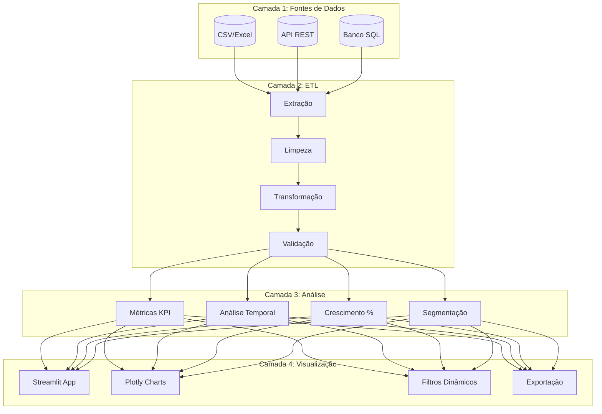

```markdown
<div align="center">
  
  
</div>

<br>

<div align="center">
  <h1>📊 DASHBOARD DE ANÁLISE DE VENDAS</h1>
  <h3>Solução Completa para Inteligência de Negócio</h3>
  <p><i>Transformando dados brutos em decisões estratégicas</i></p>
</div>

<div align="center">
  
  
  
  
  
  
</div>

<br>

---

## 📋 SUMÁRIO EXECUTIVO

- [🎯 Visão Geral do Projeto](#-visão-geral-do-projeto)
- [✨ Funcionalidades](#-funcionalidades)
- [📈 Métrica de Crescimento (Diferencial)](#-métrica-de-crescimento-diferencial-estratégico)
- [🏗️ Arquitetura da Solução](#️-arquitetura-da-solução)
- [🛠️ Stack Tecnológica](#️-stack-tecnológica)
- [⚙️ Instalação e Configuração](#️-instalação-e-configuração)
- [📁 Estrutura do Projeto](#-estrutura-do-projeto)
- [💻 Como Utilizar](#-como-utilizar)
- [📊 Exemplos de Output](#-exemplos-de-output)
- [🧪 Testes e Qualidade](#-testes-e-qualidade)
- [🚀 Roadmap](#-roadmap)
- [🤝 Como Contribuir](#-como-contribuir)
- [📄 Licença](#-licença)
- [📞 Contato](#-contato)

---

## 🎯 VISÃO GERAL DO PROJETO

Este projeto consiste em um **Dashboard de Análise de Vendas** desenvolvido para fornecer **inteligência de negócio** acessível e acionável. A solução vai além da simples visualização de dados, entregando **insights estratégicos** que permitem:

<div align="center">

| 🎯 Objetivo | 📍 Descrição | 💼 Impacto no Negócio |
|:-----------:|:-------------|:---------------------:|
| **Monitoramento** | Acompanhamento em tempo real do desempenho comercial | Identificação rápida de oportunidades e problemas |
| **Análise Preditiva** | Identificação de tendências e padrões de consumo | Antecipação de demandas e sazonalidades |
| **Decisões Data-Driven** | Base sólida para tomada de decisão | Redução de riscos e aumento de assertividade |
| **Saúde do Negócio** | Métricas de crescimento e performance | Visão clara da evolução do negócio |

</div>

---

## ✨ FUNCIONALIDADES

### 📊 1. VISÃO EXECUTIVA (KPIs)

```python
# Métricas calculadas em tempo real
KPI_DASHBOARD = {
    'receita_total': '∑(preço * quantidade)',
    'ticket_medio': 'receita_total / total_pedidos',
    'total_pedidos': 'COUNT(order_id)',
    'clientes_ativos': 'COUNT(DISTINCT customer_id)'
}
```

| KPI | Fórmula | O que revela | Aplicação |
|:----|:--------|:-------------|:----------|
| **Receita Total** | Soma de todas as vendas | Saúde financeira geral | Planejamento orçamentário |
| **Ticket Médio** | Receita / Pedidos | Poder de compra dos clientes | Estratégias de upselling |
| **Total de Pedidos** | Contagem de transações | Volume de vendas | Avaliação de demanda |
| **Clientes Ativos** | Clientes únicos | Base de clientes | Retenção e aquisição |

### 📈 2. ANÁLISE TEMPORAL

<div align="center">

| Período | Visualização | Insights Gerados | Decisões Possíveis |
|:-------:|:------------:|:-----------------|:-------------------|
| **Diário** | Linha do tempo | Picos e quedas diárias | Ajustes operacionais |
| **Mensal** | Comparativo mensal | Tendências de crescimento | Planejamento de metas |
| **Trimestral** | Sazonalidade | Padrões recorrentes | Estratégias sazonais |
| **Anual** | Year-over-Year | Crescimento real | Planejamento estratégico |

</div>

### 🏷️ 3. PERFORMANCE DE PRODUTOS

```python
# Ranking de produtos
top_produtos = df.groupby('produto').agg({
    'receita': 'sum',
    'quantidade': 'sum',
    'pedidos': 'nunique'
}).sort_values('receita', ascending=False)

# Análise de categorias
categorias = df.groupby('categoria').agg({
    'receita': ['sum', 'mean'],
    'produto': 'nunique'
})
```

### 🌍 4. ANÁLISE GEOGRÁFICA

- **Mapas de calor** por região/país
- **Concentração** de vendas
- **Oportunidades** de expansão
- **Performance** por mercado

### 🎯 5. SEGMENTAÇÃO AVANÇADA

- Por comportamento de compra
- Por valor de transação
- Por frequência de compras
- Por localização geográfica

---

## 📈 MÉTRICA DE CRESCIMENTO (DIFERENCIAL ESTRATÉGICO)

### 🧠 O Diferencial Competitivo

Enquanto dashboards convencionais mostram **apenas o que aconteceu**, nossa solução responde:

<div align="center">

| ❓ Pergunta | 📊 Resposta | 💡 Impacto |
|:-----------:|:-----------:|:----------:|
| O que aconteceu? | Dados brutos e históricos | Visão reativa |
| **Por que aconteceu?** | **Análise de correlação** | **Diagnóstico** |
| **O que significa?** | **Contextualização** | **Interpretação** |
| **Para onde vamos?** | **Tendências e projeções** | **Estratégia proativa** |

</div>

### 💻 Implementação Técnica

```python
class AnaliseCrescimento:
    """
    Classe responsável pela análise avançada de crescimento
    """
    
    def __init__(self, dataframe):
        self.df = dataframe
        self.calcular_metricas()
    
    def calcular_crescimento_mensal(self):
        """
        Calcula crescimento percentual mês a mês
        """
        # Agregação mensal
        df_mensal = (self.df
                     .set_index('data')
                     .resample('M')['receita']
                     .sum()
                     .reset_index())
        
        # Cálculo do crescimento
        df_mensal['crescimento_%'] = df_mensal['receita'].pct_change() * 100
        
        # Classificação inteligente
        df_mensal['classificacao'] = df_mensal['crescimento_%'].apply(
            lambda x: '🚀 ACELERAÇÃO' if x > 10 
            else '📈 POSITIVO' if x > 0 
            else '📉 NEGATIVO' if x < 0 
            else '⚖️ ESTÁVEL'
        )
        
        # Insight automático
        df_mensal['insight'] = df_mensal.apply(self._gerar_insight, axis=1)
        
        return df_mensal
    
    def _gerar_insight(self, row):
        """Gera insights automáticos baseados nos dados"""
        if row['crescimento_%'] > 15:
            return "Crescimento expressivo - Investigar causas para replicar"
        elif row['crescimento_%'] < -10:
            return "Queda significativa - Ação corretiva necessária"
        elif abs(row['crescimento_%']) < 2:
            return "Período de estabilidade"
        else:
            return "Tendência normal de mercado"
```

---

## 🏗️ ARQUITETURA DA SOLUÇÃO



---

## 🛠️ STACK TECNOLÓGICA

<div align="center">

| Categoria | Tecnologia | Versão | Badge | Função |
|:---------:|:----------:|:------:|:-----:|:-------|
| **Linguagem** | Python | ≥3.8 |  | Core |
| **Framework Web** | Streamlit | ≥1.28 |  | Interface |
| **Manipulação** | Pandas | 1.5.3 |  | ETL |
| **Visualização** | Plotly | ≥5.14 |  | Gráficos |
| **Formatação** | Black | - |  | Padrão |
| **Testes** | Pytest | ≥7.0 |  | Qualidade |

</div>

---

## ⚙️ INSTALAÇÃO E CONFIGURAÇÃO

### Pré-requisitos

```bash
# Versões mínimas necessárias
Python >= 3.8
pip >= 21.0
Git (opcional, para clonagem)
```

### Passo a Passo

```bash
# 1. Clone o repositório
git clone https://github.com/saumelmaiapro/analyse-vendas-python.git
cd analyse-vendas-python

# 2. Crie ambiente virtual
python -m venv venv

# 3. Ative o ambiente
# Windows:
venv\Scripts\activate
# Linux/Mac:
source venv/bin/activate

# 4. Instale dependências
pip install -r requirements.txt

# 5. Execute a aplicação
streamlit run app.py
```

### 📋 requirements.txt

```txt
# Core Dependencies
streamlit==1.28.0
pandas==1.5.3
plotly==5.14.0
numpy==1.24.0

# Utilities
python-dotenv==1.0.0
openpyxl==3.1.0
xlsxwriter==3.1.0

# Development
black==23.0.0
pytest==7.4.0
pytest-cov==4.1.0
```

---

## 📁 ESTRUTURA DO PROJETO

```
📦 analyse-vendas-python
├── 📂 .github/               # Configurações GitHub
│   └── workflows/            # CI/CD Actions
│
├── 📂 src/                    # Código fonte
│   ├── 📂 components/         # Componentes UI
│   │   ├── __init__.py
│   │   ├── kpis.py           # Cards de KPIs
│   │   ├── charts.py         # Gráficos Plotly
│   │   └── filters.py        # Filtros interativos
│   │
│   ├── 📂 analytics/          # Lógica de negócio
│   │   ├── __init__.py
│   │   ├── metrics.py        # Cálculo de métricas
│   │   ├── growth.py         # Análise de crescimento
│   │   └── segmentation.py   # Segmentação de dados
│   │
│   ├── 📂 utils/              # Utilitários
│   │   ├── __init__.py
│   │   ├── helpers.py        # Funções auxiliares
│   │   ├── validators.py     # Validações
│   │   └── config.py         # Configurações
│   │
│   └── app.py                 # Aplicação principal
│
├── 📂 data/                    # Dados
│   ├── 📂 raw/                 # Dados brutos
│   ├── 📂 processed/           # Dados tratados
│   └── 📂 samples/             # Amostras para teste
│
├── 📂 tests/                    # Testes
│   ├── test_metrics.py
│   ├── test_growth.py
│   └── conftest.py
│
├── 📂 docs/                     # Documentação
│   └── images/                  # Imagens
│
├── .gitignore
├── .env.example                 # Exemplo de variáveis
├── README.md                     # Este arquivo
├── requirements.txt              # Dependências
├── LICENSE                       # MIT License
└── Makefile                      # Comandos úteis
```

---

## 💻 COMO UTILIZAR

### 1. Preparação dos Dados

```python
# Formato esperado dos dados
import pandas as pd

dados_esperados = {
    'order_id': 'Identificador único do pedido',
    'order_date': 'Data da venda (YYYY-MM-DD)',
    'customer_id': 'ID do cliente',
    'customer_name': 'Nome do cliente',
    'product_id': 'ID do produto',
    'product_name': 'Nome do produto',
    'category': 'Categoria do produto',
    'quantity': 'Quantidade vendida',
    'unit_price': 'Preço unitário',
    'total_price': 'Preço total',
    'country': 'País da venda',
    'payment_method': 'Método de pagamento'
}
```

### 2. Execução do Dashboard

```bash
# Modo desenvolvimento (com hot reload)
streamlit run src/app.py --server.port 8501

# Modo produção
streamlit run src/app.py --server.headless true --server.port 80
```

### 3. Acessando

```
🌐 Local: http://localhost:8501
🌐 Rede: http://[SEU-IP]:8501
```

---

## 📊 EXEMPLOS DE OUTPUT

### 📈 Análise de Crescimento

| Mês | Receita | Crescimento | Classificação | Insight Gerado |
|-----|---------|-------------|---------------|----------------|
| Jan/24 | R$ 100.000 | — | ⚖️ Baseline | Período base para comparações |
| Fev/24 | R$ 120.000 | +20,0% | 🚀 ACELERAÇÃO | Campanha de verão eficaz |
| Mar/24 | R$ 115.000 | -4,2% | 📉 NEGATIVO | Queda pós-campanha - investigar |
| Abr/24 | R$ 125.000 | +8,7% | 📈 POSITIVO | Recuperação consistente |

### 📊 Dashboard Preview

```
┌─────────────────────────────────────────────────────────────┐
│  📊 DASHBOARD DE VENDAS                          [Filtros] ▼ │
├─────────────────────────────────────────────────────────────┤
│  ┌─────────────┐ ┌─────────────┐ ┌─────────────┐           │
│  │  RECEITA    │ │ TICKET MÉDIO│ │   PEDIDOS   │           │
│  │  R$ 1.2M    │ │   R$ 350    │ │    3.428    │           │
│  │  ▲ +15%     │ │   ▲ +5%     │ │   ▲ +10%    │           │
│  └─────────────┘ └─────────────┘ └─────────────┘           │
│                                                             │
│  ┌────────────────────────────────────────────────────┐    │
│  │           EVOLUÇÃO DE VENDAS - 2024                │    │
│  │  150K ████                                          │    │
│  │  100K ███▓████▓██▓████▓██▓████▓██▓████▓██▓████▓██  │    │
│  │   50K ████████████████████████████████████████████  │    │
│  │    0K ████████████████████████████████████████████  │    │
│  │      Jan  Fev  Mar  Abr  Mai  Jun  Jul  Ago  Set   │    │
│  └────────────────────────────────────────────────────┘    │
└─────────────────────────────────────────────────────────────┘
```

---

## 🧪 TESTES E QUALIDADE

### Executando Testes

```bash
# Executar todos os testes
pytest tests/ -v

# Com cobertura
pytest tests/ --cov=src --cov-report=html

# Testes específicos
pytest tests/test_growth.py -v
```

### Padrões de Código

```bash
# Formatação com Black
black src/ tests/

# Verificação de estilo
flake8 src/ --max-line-length=88

# Type checking
mypy src/ --ignore-missing-imports
```

---

## 🚀 ROADMAP

### ✅ Versão 1.0 (Concluído)
- [x] Dashboard base com KPIs principais
- [x] Gráficos interativos com Plotly
- [x] Filtros dinâmicos
- [x] Análise temporal básica

### 🔄 Versão 2.0 (Em desenvolvimento)
- [ ] Machine Learning para previsões
- [ ] Integração com Google Analytics
- [ ] Alertas automáticos por email
- [ ] Exportação de relatórios

### 📅 Versão 3.0 (Planejado)
- [ ] App mobile
- [ ] Integração com WhatsApp
- [ ] Dashboard multicliente
- [ ] API pública

---

## 🤝 COMO CONTRIBUIR

### Fluxo de Contribuição

```bash
1. 🍴 Fork o projeto
2. 🌿 Crie sua branch: `git checkout -b feature/nova-funcionalidade`
3. 💾 Commit: `git commit -m 'Add: nova funcionalidade'`
4. 📤 Push: `git push origin feature/nova-funcionalidade`
5. 🔃 Abra um Pull Request
```

### Padrões de Commit

| Tipo | Descrição | Exemplo |
|:----:|:----------|:--------|
| **Add** | Nova funcionalidade | `Add: gráfico de barras empilhadas` |
| **Fix** | Correção de bug | `Fix: cálculo do ticket médio` |
| **Docs** | Documentação | `Docs: atualiza README` |
| **Style** | Formatação | `Style: aplica black` |
| **Refactor** | Refatoração | `Refactor: otimiza query pandas` |
| **Test** | Testes | `Test: adiciona testes growth` |

---

## 📄 LICENÇA

Este projeto está licenciado sob a **MIT License** - veja o arquivo [LICENSE](LICENSE) para detalhes.

```
MIT License

Copyright (c) 2026 Saumel Maia

Permission is hereby granted, free of charge, to any person obtaining a copy
of this software and associated documentation files...
```

---

## 📞 CONTATO

<div align="center">
  <h3>Saumel Maia</h3>
  <p><i>Analista de Dados Sênior</i></p>
  
  <a href="mailto:smaia2@gmail.com">
    
  </a>
  
  <a href="https://linkedin.com/in/saumelmaiapro">
    
  </a>
  
  <a href="https://github.com/saumelmaiapro">
    
  </a>
</div>

---

<div align="center">
  <br>
  <p>⭐️ Se este projeto te ajudou, considere dar uma estrela! ⭐️</p>
  <br>
  
  
  <br>
  <br>
  <a href="#-sumário-executivo">⬆️ Voltar ao topo</a>
  <br>
  <br>
  <p><i>Desenvolvido com dedicação para a comunidade de dados</i></p>
  <p><b>© 2026 Saumel de Andrade Maia. Todos os direitos reservados.</b></p>
</div>
```