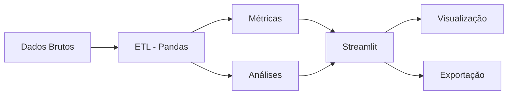

```markdown
<div align="center">
    
    
</div>

<br>

<div align="center">
    <h1>📊 DASHBOARD DE ANÁLISE DE VENDAS</h1>
    <h3>Solução Completa para Inteligência de Negócio</h3>
    <p><i>Transformando dados brutos em decisões estratégicas</i></p>
</div>

<div align="center">
    
    
    
    
    
    
</div>

---

## 📋 SUMÁRIO EXECUTIVO

- [🎯 Visão Geral do Projeto](#-visão-geral-do-projeto)
- [✨ Funcionalidades](#-funcionalidades)
- [📈 Métrica de Crescimento (Diferencial)](#-métrica-de-crescimento-diferencial-estratégico)
- [🏗️ Arquitetura da Solução](#️-arquitetura-da-solução)
- [🛠️ Stack Tecnológica](#️-stack-tecnológica)
- [⚙️ Instalação e Configuração](#️-instalação-e-configuração)
- [📁 Estrutura do Projeto](#-estrutura-do-projeto)
- [💻 Como Utilizar](#-como-utilizar)
- [📊 Exemplos de Output](#-exemplos-de-output)
- [🧪 Testes e Qualidade](#-testes-e-qualidade)
- [🚀 Roadmap](#-roadmap)
- [🤝 Como Contribuir](#-como-contribuir)
- [📄 Licença](#-licença)
- [📞 Contato](#-contato)

---

## 🎯 VISÃO GERAL DO PROJETO

Este projeto consiste em um **Dashboard de Análise de Vendas** desenvolvido para fornecer **inteligência de negócio** acessível e acionável. A solução vai além da simples visualização de dados, entregando **insights estratégicos** que permitem:

<div align="center">

| 🎯 Objetivo | 📍 Descrição | 💼 Impacto no Negócio |
|:-----------:|:-------------|:---------------------:|
| **Monitoramento** | Acompanhamento em tempo real do desempenho comercial | Identificação rápida de oportunidades e problemas |
| **Análise Preditiva** | Identificação de tendências e padrões de consumo | Antecipação de demandas e sazonalidades |
| **Decisões Data-Driven** | Base sólida para tomada de decisão | Redução de riscos e aumento de assertividade |
| **Saúde do Negócio** | Métricas de crescimento e performance | Visão clara da evolução do negócio |

</div>

---

## ✨ FUNCIONALIDADES

### 📊 1. VISÃO EXECUTIVA (KPIs)

```python
# Métricas calculadas em tempo real
KPI_DASHBOARD = {
    'receita_total': '∑(preço * quantidade)',
    'ticket_medio': 'receita_total / total_pedidos',
    'total_pedidos': 'COUNT(order_id)',
    'clientes_ativos': 'COUNT(DISTINCT customer_id)'
}
```

<div align="center">

| KPI | Fórmula | Descrição | Impacto |
|:----|:--------|:----------|:--------|
| **Receita Total** | `∑(preço * quantidade)` | Soma de todas as vendas | Visão macro do faturamento |
| **Ticket Médio** | `receita_total / total_pedidos` | Valor médio por transação | Avalia poder de compra |
| **Total de Pedidos** | `COUNT(order_id)` | Número de transações | Mede volume de vendas |
| **Clientes Ativos** | `COUNT(DISTINCT customer_id)` | Clientes que compraram | Tamanho da base |

</div>

### 📈 2. ANÁLISE TEMPORAL

<div align="center">

| Período | Visualização | Insights Gerados | Decisões Possíveis |
|:-------:|:------------:|:-----------------|:-------------------|
| **Diário** | Linha do tempo | Picos e quedas diárias | Ajustes operacionais |
| **Mensal** | Comparativo mensal | Tendências de crescimento | Planejamento de metas |
| **Trimestral** | Análise sazonal | Padrões recorrentes | Estratégias sazonais |
| **Anual** | Year-over-Year | Crescimento real | Planejamento estratégico |

</div>

```python
def analise_temporal(df, periodo='M'):
    """
    Análise de vendas ao longo do tempo
    
    Args:
        df: DataFrame com dados de venda
        periodo: 'D' diário, 'M' mensal, 'Q' trimestral, 'Y' anual
    
    Returns:
        DataFrame com evolução temporal
    """
    df_temporal = df.set_index('data').resample(periodo).agg({
        'receita': 'sum',
        'pedido_id': 'count',
        'cliente_id': 'nunique'
    }).reset_index()
    
    df_temporal['crescimento'] = df_temporal['receita'].pct_change() * 100
    
    return df_temporal
```

### 🏷️ 3. PERFORMANCE DE PRODUTOS

```python
def ranking_produtos(df):
    """
    Ranking de produtos mais lucrativos
    """
    ranking = df.groupby(['categoria', 'produto']).agg({
        'receita': 'sum',
        'quantidade': 'sum',
        'pedido_id': 'nunique'
    }).round(2)
    
    ranking.columns = ['receita_total', 'unidades_vendidas', 'total_pedidos']
    ranking = ranking.sort_values('receita_total', ascending=False)
    ranking['participacao'] = (ranking['receita_total'] / ranking['receita_total'].sum() * 100).round(1)
    
    return ranking
```

<div align="center">

| Categoria | Produto | Receita | Unidades | Participação |
|:---------:|:--------|--------:|---------:|:------------:|
| Eletrônicos | Notebook Pro | R$ 150.000 | 50 | 25% |
| Vestuário | Camisa Social | R$ 45.000 | 450 | 7,5% |
| Alimentos | Café Gourmet | R$ 30.000 | 600 | 5% |

</div>

### 🌍 4. ANÁLISE GEOGRÁFICA

```python
def analise_geografica(df):
    """
    Distribuição geográfica das vendas
    """
    geo_analise = df.groupby('pais').agg({
        'receita': 'sum',
        'cliente_id': 'nunique',
        'pedido_id': 'count'
    }).reset_index()
    
    geo_analise.columns = ['país', 'receita_total', 'clientes', 'pedidos']
    geo_analise['ticket_medio'] = (geo_analise['receita_total'] / geo_analise['pedidos']).round(2)
    
    return geo_analise.sort_values('receita_total', ascending=False)
```

---

## 📈 MÉTRICA DE CRESCIMENTO (DIFERENCIAL ESTRATÉGICO)

### O Diferencial Competitivo

Enquanto dashboards convencionais mostram **apenas o que aconteceu**, nossa solução responde:

<div align="center">

| Nível | Pergunta | Resposta | Ação |
|:-----:|:--------:|:--------:|:----:|
| **Básico** | O que aconteceu? | Dados brutos | Visão reativa |
| **Intermediário** | Por que aconteceu? | Análise de correlação | Diagnóstico |
| **Avançado** | O que significa? | Contextualização | Interpretação |
| **Estratégico** | Para onde vamos? | Tendências e projeções | Ação proativa |

</div>

### Implementação Técnica

```python
class MetricasCrescimento:
    """
    Classe responsável pela análise avançada de crescimento
    """
    
    def __init__(self, df):
        self.df = df
        self.df_mensal = self._agregar_mensal()
    
    def _agregar_mensal(self):
        """Agrega dados por mês"""
        return (self.df
                .set_index('data')
                .resample('M')['receita']
                .sum()
                .reset_index())
    
    def calcular_crescimento(self):
        """
        Calcula crescimento percentual mês a mês
        """
        df = self.df_mensal.copy()
        df['crescimento_%'] = df['receita'].pct_change() * 100
        df['crescimento_%'] = df['crescimento_%'].round(1)
        
        # Classificação inteligente
        conditions = [
            df['crescimento_%'] > 10,
            df['crescimento_%'] > 0,
            df['crescimento_%'] < 0
        ]
        choices = ['🚀 Aceleração', '📈 Positivo', '📉 Negativo']
        df['status'] = np.select(conditions, choices, default='⚖️ Estável')
        
        # Insights automáticos
        df['insight'] = df.apply(self._gerar_insight, axis=1)
        
        return df
    
    def _gerar_insight(self, row):
        """Gera insights baseados nos dados"""
        if pd.isna(row['crescimento_%']):
            return "Período base"
        elif row['crescimento_%'] > 15:
            return "Crescimento expressivo - Investigar causas para replicar"
        elif row['crescimento_%'] < -10:
            return "Queda significativa - Ação corretiva necessária"
        elif abs(row['crescimento_%']) < 2:
            return "Período de estabilidade"
        else:
            return "Tendência normal de mercado"
```

### 📊 Exemplo de Output

<div align="center">

| Mês | Receita | Crescimento | Status | Insight |
|:---:|--------:|------------:|:------:|:--------|
| Jan/24 | R$ 100.000 | - | ⚖️ Baseline | Período base |
| Fev/24 | R$ 120.000 | +20,0% | 🚀 Aceleração | Campanha eficaz - replicar |
| Mar/24 | R$ 115.000 | -4,2% | 📉 Negativo | Queda pós-campanha - investigar |
| Abr/24 | R$ 125.000 | +8,7% | 📈 Positivo | Recuperação consistente |

</div>

---

## 🏗️ ARQUITETURA DA SOLUÇÃO

```
┌─────────────────────────────────────────────────────────────┐
│                    ARQUITETURA DO DASHBOARD                  │
├─────────────────────────────────────────────────────────────┤
│                                                              │
│  ┌──────────────┐    ┌──────────────┐    ┌──────────────┐  │
│  │   CAMADA 1   │    │   CAMADA 2   │    │   CAMADA 3   │  │
│  │   DADOS      │───▶│   PROCESSO   │───▶│  VISÃO       │  │
│  └──────────────┘    └──────────────┘    └──────────────┘  │
│         │                   │                   │           │
│         ▼                   ▼                   ▼           │
│  ┌──────────────┐    ┌──────────────┐    ┌──────────────┐  │
│  │ • CSVs       │    │ • Pandas     │    │ • Streamlit  │  │
│  │ • Excel      │    │ • Limpeza    │    │ • Plotly     │  │
│  │ • APIs       │    │ • Agregação  │    │ • KPIs       │  │
│  │ • SQL        │    │ • Validação  │    │ • Filtros    │  │
│  └──────────────┘    └──────────────┘    └──────────────┘  │
│                                                              │
└─────────────────────────────────────────────────────────────┘
```

### Fluxo de Dados



---

## 🛠️ STACK TECNOLÓGICA

<div align="center">

| Categoria | Tecnologia | Versão | Badge | Finalidade |
|:---------:|:----------:|:------:|:-----:|:-----------|
| **Linguagem** | Python | ≥3.8 |  | Core da aplicação |
| **Framework** | Streamlit | ≥1.28 |  | Interface web |
| **Manipulação** | Pandas | 1.5.3 |  | ETL e análises |
| **Visualização** | Plotly | ≥5.14 |  | Gráficos |
| **Formatação** | Black | - |  | Padrão de código |

</div>

---

## ⚙️ INSTALAÇÃO E CONFIGURAÇÃO

### Pré-requisitos

```bash
# Versões necessárias
Python >= 3.8
pip >= 21.0
Git (opcional)
```

### Passo a Passo

```bash
# 1. Clone o repositório
git clone https://github.com/saumelmaiapro/analyse-vendas-python.git
cd analyse-vendas-python

# 2. Crie ambiente virtual
python -m venv venv

# 3. Ative o ambiente
# Windows:
venv\Scripts\activate
# Linux/Mac:
source venv/bin/activate

# 4. Instale dependências
pip install -r requirements.txt

# 5. Execute
streamlit run app.py
```

### 📋 requirements.txt

```txt
# Core
streamlit==1.28.0
pandas==1.5.3
plotly==5.14.0
numpy==1.24.0

# Utilities
python-dotenv==1.0.0
openpyxl==3.1.0
xlsxwriter==3.1.0

# Development
black==23.0.0
pytest==7.4.0
```

---

## 📁 ESTRUTURA DO PROJETO

```
📦 analyse-vendas-python
├── 📂 src/
│   ├── 📂 components/
│   │   ├── kpis.py
│   │   ├── charts.py
│   │   └── filters.py
│   ├── 📂 analytics/
│   │   ├── metrics.py
│   │   ├── growth.py
│   │   └── segmentation.py
│   ├── 📂 utils/
│   │   ├── helpers.py
│   │   └── validators.py
│   └── app.py
├── 📂 data/
│   ├── raw/
│   └── processed/
├── 📂 tests/
├── .gitignore
├── README.md
├── requirements.txt
└── LICENSE
```

---

## 💻 COMO UTILIZAR

### Preparação dos Dados

```python
# Formato esperado
dados = {
    'data': '2024-01-15',
    'produto': 'Notebook Pro',
    'categoria': 'Eletrônicos',
    'quantidade': 2,
    'preco_unitario': 3500.00,
    'receita': 7000.00,
    'cliente_id': 'CUST-001',
    'pais': 'Brasil'
}
```

### Execução

```bash
# Desenvolvimento
streamlit run src/app.py --server.port 8501

# Produção
streamlit run src/app.py --server.headless true
```

### Acesso

```
🌐 Local: http://localhost:8501
🌐 Rede: http://[SEU-IP]:8501
```

---

## 🧪 TESTES E QUALIDADE

```bash
# Executar testes
pytest tests/ -v

# Com cobertura
pytest tests/ --cov=src --cov-report=html

# Formatação
black src/ tests/
```

---

## 🚀 ROADMAP

### ✅ Versão 1.0
- [x] Dashboard base com KPIs
- [x] Gráficos interativos
- [x] Filtros dinâmicos

### 🔄 Versão 2.0
- [ ] Machine Learning
- [ ] Alertas automáticos
- [ ] Exportação de relatórios

### 📅 Versão 3.0
- [ ] App mobile
- [ ] API pública
- [ ] Integração WhatsApp

---

## 🤝 COMO CONTRIBUIR

1. **Fork** o projeto
2. **Branch**: `git checkout -b feature/nova-funcionalidade`
3. **Commit**: `git commit -m 'Add: nova funcionalidade'`
4. **Push**: `git push origin feature/nova-funcionalidade`
5. **Pull Request**

### Padrões de Commit

- `Add:` - Nova funcionalidade
- `Fix:` - Correção
- `Docs:` - Documentação
- `Style:` - Formatação
- `Refactor:` - Refatoração

---

## 📄 LICENÇA

MIT License © 2026 Saumel Maia

---

## 📞 CONTATO

<div align="center">
    <h3>Saumel Maia</h3>
    <p><i>Analista de Dados Sênior</i></p>
    
    <a href="mailto:smaia2@gmail.com">
        
    </a>
    
    <a href="https://linkedin.com/in/saumelmaiapro">
        
    </a>
    
    <a href="https://github.com/saumelmaiapro">
        
    </a>
</div>

---

<div align="center">
    <br>
    <p>⭐️ Se este projeto te ajudou, considere dar uma estrela! ⭐️</p>
    <br>
    <a href="#-dashboard-de-análise-de-vendas">⬆️ Voltar ao topo</a>
    <br>
    <br>
    <p><i>Desenvolvido com dedicação para a comunidade de dados</i></p>
</div>
```

