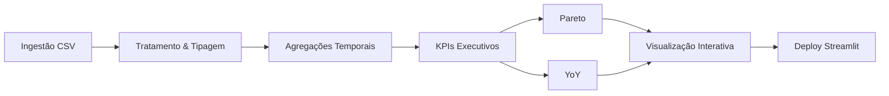

# 📊 Sales Analytics Dashboard – End-to-End Data Project


🚀 **Deploy:**  
https://analys-vendas-python.streamlit.app/

📂 **Repositório:**  
https://github.com/samuelmaiapro/analise-vendas-python

---

# 🧭 Executive Summary

Projeto **end-to-end de Sales Analytics**, estruturado como um caso real de negócio.

O sistema transforma dados transacionais em decisões estratégicas por meio de:

- 📈 Análise de crescimento periódico  
- 🧾 Métricas executivas consolidadas  
- 🧩 Análise de concentração (Pareto automático)  
- 📅 Comparação Year-over-Year (YoY)  
- 📊 Visualizações interativas  

---

# 📊 Fonte de Dados

## 1️⃣ Upload Dinâmico de CSV
- Seleção automática de coluna de data  
- Seleção automática de coluna de valor  
- Compatível com qualquer dataset transacional  

## 2️⃣ Dataset Base Utilizado

Kaggle – Sample Sales Data  
https://www.kaggle.com/datasets/kyanyoga/sample-sales-data  

Principais resultados identificados:

- Receita total analisada: **$10M+**
- Crescimento médio mensal: **~14%**
- Top 3 linhas de produto representam **~70% da receita**
- Pico sazonal identificado em **novembro**

## 3️⃣ Dados Simulados

Fallback automático com:
- Tendência de crescimento  
- Sazonalidade anual  
- Ruído estatístico controlado  

---

# 🧾 Métricas Executivas

- Receita Total  
- Pico Sazonal (detecção automática)  
- Concentração Top 3 por dimensão  
- Crescimento Médio  
- Melhor e Pior Período  
- YoY (Year-over-Year) mensal  

---

# 🧩 Pareto Automático

O sistema gera automaticamente:

- Ranking por dimensão (produto, categoria, país, etc.)
- Percentual individual de participação
- Percentual acumulado
- Visualização combinada (barras + linha acumulada)

Permite identificar concentração de receita e risco de dependência.

---

# 📅 Comparação YoY

Cálculo automático de:

- Total mensal agregado
- Variação absoluta YoY
- Variação percentual YoY
- Visualização com eixo duplo (Total + % YoY)

Permite avaliar crescimento sustentável e sazonalidade estrutural.

---

# 🔄 Pipeline de Dados


# 🏗 Arquitetura

Estruturado com foco em separação de responsabilidades:

Funções utilitárias isoladas

Cálculos desacoplados

Funções dedicadas para Pareto e YoY

Cache inteligente (@st.cache_data)

Tratamento seguro de tipos (datetime / numeric)

Fallback robusto de dados

# 🎯 Executive Business Case
# 🔴 Risco Identificado

Alta concentração de receita (~70%) em poucas linhas de produto.

# 🟢 Oportunidade

Crescimento médio mensal consistente (~14%).

# 🟡 Estratégia Recomendada

Diversificação de portfólio

Planejamento antecipado para pico sazonal (Q4)

Padronização e governança de KPIs

# 🛠 Stack Tecnológica

Python

Pandas

NumPy

Plotly

Streamlit

Docker

Pytest

▶ Execução
Local
```
streamlit run app.py
```
Docker
```
docker-compose up --build
```
# 🚀 Roadmap

Integração com banco de dados

Pipeline ETL automatizado

Monitoramento de performance

Deploy escalável em cloud

Camada semântica de métricas

# 🧠 Diferencial Estratégico

Este projeto demonstra:

Capacidade técnica end-to-end

Tradução de dados em decisões executivas

Arquitetura preparada para evolução

Maturidade analítica e visão estratégica

⭐ Se este projeto foi útil ou inspirador, considere deixar uma estrela.