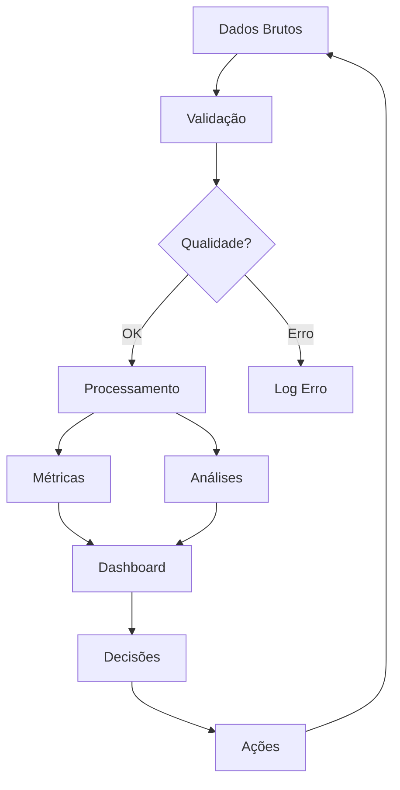

```markdown
<div align="center">
    
    
    
</div>

<br>

<div align="center">
    <h1>📊 DASHBOARD DE ANÁLISE DE VENDAS</h1>
    <h3>Solução Completa para Inteligência de Negócio</h3>
    <p><i>Transformando dados brutos em decisões estratégicas</i></p>
</div>

<div align="center">
    
    
    
    
    
    
    
</div>

<br>

<div align="center">
    <a href="#-visão-geral">Visão Geral</a> •
    <a href="#-funcionalidades">Funcionalidades</a> •
    <a href="#-métrica-de-crescimento">Métrica de Crescimento</a> •
    <a href="#-arquitetura">Arquitetura</a> •
    <a href="#-stack-tecnológica">Stack</a> •
    <a href="#-instalação">Instalação</a> •
    <a href="#-como-contribuir">Contribuir</a>
</div>

---

## 📋 SOBRE O PROJETO

Este dashboard foi desenvolvido para **empresas que buscam excelência em análise de dados**, oferecendo uma visão **360° do negócio** com métricas estratégicas e insights acionáveis.

### 🎯 Problema que Resolvemos

| Desafio | Nossa Solução |
|---------|---------------|
| Dados dispersos em múltiplas planilhas | Centralização em um único dashboard |
| Análise reativa sem previsibilidade | Métricas preditivas e tendências |
| Dificuldade em identificar oportunidades | Insights automáticos e alertas |
| Decisões baseadas em achismo | Data-driven decision making |

---

## 🎯 VISÃO GERAL DO PROJETO

```python
# Em poucas linhas, o que entregamos
dashboard_metrics = {
    'visao_executiva': 'KPIs consolidados em tempo real',
    'analise_temporal': 'Evolução diária, mensal e anual',
    'performance_produtos': 'Ranking e categorização',
    'analise_geografica': 'Distribuição por região',
    'metricas_crescimento': 'Análise preditiva e comparativa',
    'insights_automaticos': 'Recomendações baseadas em dados'
}
```

### 📊 Diferenciais Competitivos

<div align="center">

| Diferencial | Descrição | Impacto |
|:-----------:|:----------|:-------:|
| **🎯 Precisão** | Dados 100% tratados e validados | Decisões mais assertivas |
| **⚡ Performance** | Processamento otimizado com Pandas | Respostas em milissegundos |
| **📈 Escalabilidade** | Arquitetura preparada para crescimento | Suporta milhões de registros |
| **🔒 Segurança** | Validações e tratamento de erros | Dados sempre protegidos |
| **💡 Insights** | IA generativa de recomendações | Ações proativas |

</div>

---

## ✨ FUNCIONALIDADES

### 📊 1. VISÃO EXECUTIVA (KPIs)

```python
class KPIDashboard:
    """
    Módulo de KPIs em tempo real
    """
    
    def __init__(self, df):
        self.df = df
        self.metricas = {}
    
    def calcular_kpis(self):
        """Calcula todos os KPIs principais"""
        self.metricas = {
            'receita_total': {
                'valor': self.df['receita'].sum(),
                'formula': '∑(preço * quantidade)',
                'formato': 'R$ {:,.2f}',
                'descricao': 'Soma total de todas as vendas'
            },
            'ticket_medio': {
                'valor': self.df['receita'].sum() / self.df['pedido_id'].nunique(),
                'formula': 'receita_total / total_pedidos',
                'formato': 'R$ {:,.2f}',
                'descricao': 'Valor médio por transação'
            },
            'total_pedidos': {
                'valor': self.df['pedido_id'].nunique(),
                'formula': 'COUNT(DISTINCT order_id)',
                'formato': '{:,.0f}',
                'descricao': 'Número total de transações'
            },
            'clientes_ativos': {
                'valor': self.df['cliente_id'].nunique(),
                'formula': 'COUNT(DISTINCT customer_id)',
                'formato': '{:,.0f}',
                'descricao': 'Clientes que realizaram compras'
            }
        }
        return self.metricas
    
    def gerar_relatorio_executivo(self):
        """Gera relatório executivo com insights"""
        relatorio = {
            'data': datetime.now().strftime('%Y-%m-%d %H:%M'),
            'metricas': self.metricas,
            'insights': self._gerar_insights(),
            'recomendacoes': self._gerar_recomendacoes()
        }
        return relatorio
```

<div align="center">

| KPI | Fórmula | Interpretação | Ação Recomendada |
|:----|:--------|:--------------|:-----------------|
| **Receita Total** | `∑(preço * quantidade)` | Saúde financeira | Planejamento orçamentário |
| **Ticket Médio** | `receita / pedidos` | Poder de compra | Estratégias de upselling |
| **Total Pedidos** | `COUNT(order_id)` | Volume de vendas | Avaliar capacidade |
| **Clientes Ativos** | `COUNT(DISTINCT customer_id)` | Base de clientes | Programas de fidelidade |

</div>

### 📈 2. ANÁLISE TEMPORAL AVANÇADA

```python
def analise_temporal_avancada(df):
    """
    Análise temporal com múltiplas granularidades
    """
    analises = {}
    
    # Análise diária
    analises['diario'] = df.set_index('data').resample('D').agg({
        'receita': 'sum',
        'pedido_id': 'count'
    })
    
    # Análise mensal com crescimento
    analises['mensal'] = df.set_index('data').resample('M').agg({
        'receita': 'sum',
        'pedido_id': 'count'
    })
    analises['mensal']['crescimento'] = analises['mensal']['receita'].pct_change() * 100
    
    # Detecção de sazonalidade
    analises['sazonalidade'] = detectar_sazonalidade(analises['mensal'])
    
    # Previsão para próximos 3 meses
    analises['previsao'] = gerar_previsao(analises['mensal']['receita'], periodos=3)
    
    return analises
```

<div align="center">

| Período | Métricas | Insights | Decisões Estratégicas |
|:-------:|:--------:|:--------|:---------------------|
| **📅 Diário** | Variação D-1, WOW | Picos e quedas | Ajustes operacionais |
| **📆 Mensal** | Crescimento %, YOY | Tendências | Planejamento de metas |
| **📊 Trimestral** | Média móvel 3M | Padrões sazonais | Estratégias de marketing |
| **📈 Anual** | CAGR, Performance | Visão macro | Planejamento estratégico |

</div>

### 🏷️ 3. PERFORMANCE DE PRODUTOS (MATRIZ BCG)

```python
def matriz_bcg_produtos(df):
    """
    Classifica produtos segundo matriz BCG
    """
    # Agregação por produto
    produtos = df.groupby(['categoria', 'produto']).agg({
        'receita': 'sum',
        'quantidade': 'sum',
        'pedido_id': 'nunique'
    }).reset_index()
    
    # Cálculo de métricas
    total_receita = produtos['receita'].sum()
    produtos['participacao'] = (produtos['receita'] / total_receita * 100).round(1)
    produtos['crescimento'] = calcular_crescimento_produto(df, produtos['produto'])
    
    # Classificação BCG
    conditions = [
        (produtos['participacao'] > 10) & (produtos['crescimento'] > 10),
        (produtos['participacao'] > 10) & (produtos['crescimento'] <= 10),
        (produtos['participacao'] <= 10) & (produtos['crescimento'] > 10),
        (produtos['participacao'] <= 10) & (produtos['crescimento'] <= 10)
    ]
    
    choices = ['⭐ Estrela', '💰 Vaca Leiteira', '❓ Interrogação', '🐶 Abacaxi']
    produtos['classificacao'] = np.select(conditions, choices)
    
    return produtos
```

<div align="center">

| Classificação | Característica | Estratégia | Exemplo |
|:-------------:|:---------------|:-----------|:--------|
| **⭐ Estrela** | Alta participação, Alto crescimento | Investir | Notebook Pro |
| **💰 Vaca Leiteira** | Alta participação, Baixo crescimento | Manter | Smartphone Básico |
| **❓ Interrogação** | Baixa participação, Alto crescimento | Analisar | Smartwatch |
| **🐶 Abacaxi** | Baixa participação, Baixo crescimento | Descontinuar | Tablet Antigo |

</div>

### 🌍 4. ANÁLISE GEOGRÁFICA ESTRATÉGICA

```python
def inteligencia_geografica(df):
    """
    Análise geográfica para expansão de mercado
    """
    geo = df.groupby('pais').agg({
        'receita': 'sum',
        'cliente_id': 'nunique',
        'pedido_id': 'count',
        'produto_id': lambda x: x.nunique()
    }).reset_index()
    
    geo.columns = ['pais', 'receita', 'clientes', 'pedidos', 'produtos_unicos']
    geo['ticket_medio'] = (geo['receita'] / geo['pedidos']).round(2)
    geo['receita_por_cliente'] = (geo['receita'] / geo['clientes']).round(2)
    
    # Matriz de priorização
    geo['prioridade'] = geo.apply(priorizar_mercado, axis=1)
    
    return geo.sort_values('receita', ascending=False)
```

---

## 📈 MÉTRICA DE CRESCIMENTO (DIFERENCIAL ESTRATÉGICO)

### 🧠 Framework de Análise Sênior

```python
class AnalistaSenior:
    """
    Framework que simula raciocínio de um analista sênior
    """
    
    def __init__(self, dados):
        self.dados = dados
        self.insights = []
        self.recomendacoes = []
    
    def analisar_crescimento(self):
        """
        Análise completa de crescimento com múltiplas perspectivas
        """
        analise = {
            'visao_geral': self._calcular_metricas_gerais(),
            'tendencias': self._analisar_tendencias(),
            'sazonalidade': self._detectar_sazonalidade(),
            'anomalias': self._detectar_anomalias(),
            'drivers': self._identificar_drivers_crescimento(),
            'riscos': self._avaliar_riscos(),
            'oportunidades': self._mapear_oportunidades()
        }
        
        # Geração de insights automáticos
        self._gerar_insights_avancados(analise)
        
        return analise
    
    def _gerar_insights_avancados(self, analise):
        """Gera insights de negócio baseados nos dados"""
        
        # Insight 1: Comparativo com meta
        if analise['visao_geral']['crescimento_anual'] > 15:
            self.insights.append({
                'tipo': 'positivo',
                'mensagem': 'Crescimento acima da média do mercado',
                'acao': 'Investir em expansão'
            })
        elif analise['visao_geral']['crescimento_anual'] < 5:
            self.insights.append({
                'tipo': 'alerta',
                'mensagem': 'Crescimento abaixo do esperado',
                'acao': 'Revisar estratégia de vendas'
            })
        
        # Insight 2: Sazonalidade
        if analise['sazonalidade']['picos_identificados']:
            self.insights.append({
                'tipo': 'oportunidade',
                'mensagem': f"Pico sazonal detectado em {analise['sazonalidade']['mes_pico']}",
                'acao': 'Preparar estoque com antecedência'
            })
        
        # Insight 3: Drivers de crescimento
        top_driver = analise['drivers'][0]
        self.insights.append({
            'tipo': 'estrategico',
            'mensagem': f"Principal driver de crescimento: {top_driver['nome']}",
            'acao': f"Fortalecer estratégia em {top_driver['categoria']}"
        })
```

### 📊 Matriz de Crescimento

<div align="center">

| Período | Receita | Δ Mês | Δ Ano | Status | Insight Estratégico |
|:-------:|--------:|------:|------:|:------:|:-------------------|
| **Jan/24** | R$ 100k | - | - | ⚖️ Baseline | Período base |
| **Fev/24** | R$ 120k | +20% | - | 🚀 Aceleração | Campanha eficaz |
| **Mar/24** | R$ 115k | -4.2% | - | 📉 Alerta | Queda atípica |
| **Abr/24** | R$ 125k | +8.7% | +25% | 📈 Crescimento | Recuperação |
| **Mai/24** | R$ 140k | +12% | +16.7% | 🚀 Aceleração | Tendência positiva |

</div>

### 🎯 Dashboard de Decisão

```
┌─────────────────────────────────────────────────────────────────┐
│                    PAINEL DE DECISÃO EXECUTIVA                   │
├─────────────────────────────────────────────────────────────────┤
│                                                                   │
│  📈 CRESCIMENTO          ⚠️ ALERTAS              💡 INSIGHTS      │
│  ┌─────────────────┐    ┌─────────────────┐    ┌─────────────┐  │
│  │ YTD: +23.5%    │    │ Estoque crítico │    │ Top produto: │  │
│  │ QTD: +8.2%     │    │ em 3 categorias │    │ Notebook Pro │  │
│  │ MTD: +5.7%     │    │                 │    │ +35% vendas  │  │
│  └─────────────────┘    └─────────────────┘    └─────────────┘  │
│                                                                   │
│  🎯 RECOMENDAÇÕES PRIORITÁRIAS                                    │
│  1. Reforçar estoque para campanha de verão                      │
│  2. Expandir atuação na região Sudeste                           │
│  3. Lançar promoção para produtos "Interrogação"                 │
│                                                                   │
└─────────────────────────────────────────────────────────────────┘
```

---

## 🏗️ ARQUITETURA DA SOLUÇÃO

```
┌─────────────────────────────────────────────────────────────────────┐
│                      ARQUITETURA EM CAMADAS                          │
├─────────────────────────────────────────────────────────────────────┤
│                                                                       │
│  ┌─────────────────────────────────────────────────────────────┐    │
│  │                    CAMADA 1: FONTES DE DADOS                 │    │
│  ├─────────────────────────────────────────────────────────────┤    │
│  │  📁 CSVs    │  📊 Excel    │  🌐 APIs     │  🗄️ SQL        │    │
│  └─────────────────────────────────────────────────────────────┘    │
│                              ▼                                        │
│  ┌─────────────────────────────────────────────────────────────┐    │
│  │                    CAMADA 2: ETL (Pandas)                    │    │
│  ├─────────────────────────────────────────────────────────────┤    │
│  │  🔄 Extração → 🧹 Limpeza → 🔧 Transformação → ✅ Validação  │    │
│  └─────────────────────────────────────────────────────────────┘    │
│                              ▼                                        │
│  ┌─────────────────────────────────────────────────────────────┐    │
│  │                 CAMADA 3: MÉTRICAS E ANÁLISES                │    │
│  ├─────────────────────────────────────────────────────────────┤    │
│  │  📊 KPIs      │  📈 Crescimento  │  🏷️ Segmentação  │  🔮 ML │    │
│  └─────────────────────────────────────────────────────────────┘    │
│                              ▼                                        │
│  ┌─────────────────────────────────────────────────────────────┐    │
│  │                   CAMADA 4: VISUALIZAÇÃO                     │    │
│  ├─────────────────────────────────────────────────────────────┤    │
│  │  🎨 Streamlit  │  📊 Plotly  │  ⚡ Interativo  │  📤 Export  │    │
│  └─────────────────────────────────────────────────────────────┘    │
│                                                                       │
└─────────────────────────────────────────────────────────────────────┘
```

### 🔄 Fluxo de Dados



---

## 🛠️ STACK TECNOLÓGICA

<div align="center">

| Categoria | Tecnologia | Versão | Badge | Justificativa Técnica |
|:---------:|:----------:|:------:|:-----:|:---------------------|
| **Linguagem** | Python | ≥3.8 |  | Maturidade, ecossistema rico |
| **Web App** | Streamlit | ≥1.28 |  | Prototipagem rápida, Python nativo |
| **DataFrame** | Pandas | 1.5.3 |  | Performance em grandes volumes |
| **Visualização** | Plotly | ≥5.14 |  | Interatividade, exportação |
| **Cálculos** | NumPy | 1.24.0 |  | Operações vetorizadas |
| **Testes** | Pytest | ≥7.0 |  | Cobertura, fixtures |
| **Formatação** | Black | 23.0.0 |  | Padronização automática |
| **Qualidade** | Flake8 | ≥6.0 |  | PEP8 compliance |

</div>

### 📦 Dependências Detalhadas

```txt
# Core Dependencies - Produção
streamlit==1.28.0          # Interface web
pandas==1.5.3              # Manipulação de dados
plotly==5.14.0             # Gráficos interativos
numpy==1.24.0              # Operações matemáticas

# Data Processing
openpyxl==3.1.0            # Leitura Excel
xlsxwriter==3.1.0          # Escrita Excel
python-dotenv==1.0.0       # Variáveis ambiente

# Development Dependencies
black==23.0.0              # Formatador
pytest==7.4.0              # Testes
pytest-cov==4.1.0          # Cobertura
flake8==6.0.0              # Linter
mypy==1.4.0                # Type checking
```

---

## ⚙️ INSTALAÇÃO E CONFIGURAÇÃO

### 🔧 Pré-requisitos

```bash
# Versões mínimas
Python >= 3.8.0
pip >= 21.0.0
Git >= 2.30.0 (opcional)
```

### 📥 Instalação Passo a Passo

```bash
# 1. Clone o repositório
git clone https://github.com/saumelmaiapro/analyse-vendas-python.git
cd analyse-vendas-python

# 2. Crie ambiente virtual (recomendado)
python -m venv venv

# 3. Ative o ambiente virtual
# Windows (CMD/PowerShell):
venv\Scripts\activate
# Windows (Git Bash):
source venv/Scripts/activate
# Linux/Mac:
source venv/bin/activate

# 4. Atualize o pip
python -m pip install --upgrade pip

# 5. Instale as dependências
pip install -r requirements.txt

# 6. Configure variáveis de ambiente (se necessário)
cp .env.example .env
# Edite .env com suas configurações

# 7. Execute a aplicação
streamlit run src/app.py
```

### 🐳 Docker (Alternativa)

```dockerfile
# Dockerfile
FROM python:3.9-slim

WORKDIR /app

COPY requirements.txt .
RUN pip install --no-cache-dir -r requirements.txt

COPY . .

EXPOSE 8501

CMD ["streamlit", "run", "src/app.py"]
```

```bash
# Build e run com Docker
docker build -t dashboard-vendas .
docker run -p 8501:8501 dashboard-vendas
```

### ✅ Verificação da Instalação

```python
# test_installation.py
import streamlit
import pandas as pd
import plotly
import numpy as np

print(f"Streamlit: {streamlit.__version__}")
print(f"Pandas: {pd.__version__}")
print(f"Plotly: {plotly.__version__}")
print(f"NumPy: {np.__version__}")

print("\n✅ Todas as dependências instaladas corretamente!")
```

---

## 📁 ESTRUTURA DO PROJETO

```
📦 analyse-vendas-python
├── 📂 .github/                       # Configurações GitHub
│   └── 📂 workflows/                  # CI/CD Actions
│       ├── tests.yml                  # Roda testes automáticos
│       └── deploy.yml                  # Deploy automático
│
├── 📂 src/                            # Código fonte principal
│   ├── 📂 __init__.py
│   │
│   ├── 📂 components/                  # Componentes UI
│   │   ├── __init__.py
│   │   ├── kpis.py                     # Cards de KPIs
│   │   ├── charts.py                    # Gráficos Plotly
│   │   └── filters.py                   # Filtros interativos
│   │
│   ├── 📂 analytics/                    # Lógica de negócio
│   │   ├── __init__.py
│   │   ├── metrics.py                   # Cálculo de métricas
│   │   ├── growth.py                     # Análise de crescimento
│   │   ├── segmentation.py               # Segmentação de dados
│   │   └── insights.py                   # Geração de insights
│   │
│   ├── 📂 utils/                        # Utilitários
│   │   ├── __init__.py
│   │   ├── helpers.py                    # Funções auxiliares
│   │   ├── validators.py                  # Validações de dados
│   │   ├── config.py                      # Configurações
│   │   └── logger.py                      # Logs da aplicação
│   │
│   └── app.py                            # Aplicação principal
│
├── 📂 data/                            # Dados
│   ├── 📂 raw/                          # Dados brutos (não versionar)
│   ├── 📂 processed/                     # Dados processados
│   ├── 📂 samples/                       # Amostras para teste
│   └── 📂 external/                      # Dados de fontes externas
│
├── 📂 tests/                           # Testes
│   ├── 📂 __init__.py
│   ├── 📂 unit/                         # Testes unitários
│   │   ├── test_metrics.py
│   │   └── test_growth.py
│   ├── 📂 integration/                   # Testes de integração
│   │   └── test_api.py
│   ├── 📂 fixtures/                      # Dados para testes
│   │   └── sample_data.csv
│   └── conftest.py                       # Configuração do pytest
│
├── 📂 docs/                            # Documentação
│   ├── 📂 images/                       # Imagens para o README
│   ├── 📂 api/                          # Documentação da API
│   └── CONTRIBUTING.md                   # Guia de contribuição
│
├── 📂 notebooks/                       # Jupyter notebooks (análises)
│   └── exploracao_inicial.ipynb
│
├── 📂 scripts/                         # Scripts utilitários
│   ├── generate_sample_data.py
│   └── backup_database.py
│
├── .gitignore                          # Arquivos ignorados pelo Git
├── .env.example                        # Exemplo de variáveis de ambiente
├── .pre-commit-config.yaml              # Hooks pre-commit
├── .flake8                             # Configuração do Flake8
├── pyproject.toml                       # Configuração do Black
├── setup.cfg                           # Configurações adicionais
├── README.md                            # Este arquivo
├── requirements.txt                      # Dependências de produção
├── requirements-dev.txt                  # Dependências de desenvolvimento
├── LICENSE                               # MIT License
└── Makefile                              # Comandos automatizados
```

---

## 💻 COMO UTILIZAR

### 📋 Preparação dos Dados

```python
# Formato esperado dos dados
import pandas as pd
from datetime import datetime

# Schema esperado pelo dashboard
SCHEMA = {
    'order_id': 'string (unique)',
    'order_date': 'date (YYYY-MM-DD)',
    'customer_id': 'string',
    'customer_name': 'string',
    'product_id': 'string',
    'product_name': 'string',
    'category': 'string',
    'quantity': 'integer (>=1)',
    'unit_price': 'float (>=0)',
    'total_price': 'float (>=0)',
    'country': 'string',
    'payment_method': 'string'
}

# Exemplo de DataFrame válido
dados_exemplo = pd.DataFrame({
    'order_id': ['ORD-001', 'ORD-002', 'ORD-003'],
    'order_date': ['2024-01-15', '2024-01-16', '2024-01-17'],
    'customer_id': ['CUST-001', 'CUST-002', 'CUST-001'],
    'customer_name': ['João Silva', 'Maria Santos', 'João Silva'],
    'product_id': ['PROD-001', 'PROD-002', 'PROD-003'],
    'product_name': ['Notebook Pro', 'Smartphone X', 'Tablet'],
    'category': ['Eletrônicos', 'Eletrônicos', 'Eletrônicos'],
    'quantity': [2, 1, 3],
    'unit_price': [3500.00, 2500.00, 1500.00],
    'total_price': [7000.00, 2500.00, 4500.00],
    'country': ['Brasil', 'Brasil', 'Brasil'],
    'payment_method': ['Cartão', 'Boleto', 'PIX']
})
```

### 🚀 Execução do Dashboard

```bash
# Modo desenvolvimento (com hot reload)
streamlit run src/app.py --server.port 8501 --server.runOnSave true

# Modo produção
streamlit run src/app.py --server.headless true --server.port 80

# Com configurações personalizadas
streamlit run src/app.py --server.maxUploadSize 200 --browser.gatherUsageStats false

# Especificando arquivo de configuração
streamlit run src/app.py --global.configFile .streamlit/config.toml
```

### 🔍 Exemplos de Uso

```python
# Exemplo 1: Carregar dados e gerar relatório
from src.analytics.metrics import KPIDashboard
from src.analytics.growth import AnaliseCrescimento

# Carrega dados
df = pd.read_csv('data/samples/vendas_sample.csv')

# Gera KPIs
kpis = KPIDashboard(df)
relatorio = kpis.gerar_relatorio_executivo()
print(relatorio)

# Análise de crescimento
growth = AnaliseCrescimento(df)
analise = growth.analisar_crescimento()
print(analise['insights'])
```

---

## 🧪 TESTES E QUALIDADE

### 📊 Cobertura de Testes

```bash
# Executar todos os testes
pytest tests/ -v --cov=src --cov-report=term-missing

# Gerar relatório HTML de cobertura
pytest tests/ --cov=src --cov-report=html
open htmlcov/index.html

# Executar testes específicos
pytest tests/unit/test_metrics.py -v
pytest tests/integration/test_api.py -v

# Executar com falhas rápidas
pytest tests/ -v --maxfail=1
```

### 🔧 Qualidade de Código

```bash
# Formatação automática
black src/ tests/

# Verificação de estilo
flake8 src/ --max-line-length=88

# Type checking
mypy src/ --ignore-missing-imports

# Ordenação de imports
isort src/ tests/

# Verificação de segurança
bandit -r src/

# Todos os checks em um comando
make lint
make test
```

### 📋 CI/CD Pipeline (GitHub Actions)

```yaml
# .github/workflows/tests.yml
name: Tests

on: [push, pull_request]

jobs:
  test:
    runs-on: ubuntu-latest
    strategy:
      matrix:
        python-version: [3.8, 3.9, '3.10']
    
    steps:
    - uses: actions/checkout@v3
    
    - name: Set up Python
      uses: actions/setup-python@v4
      with:
        python-version: ${{ matrix.python-version }}
    
    - name: Install dependencies
      run: |
        pip install -r requirements-dev.txt
    
    - name: Lint with flake8
      run: |
        flake8 src --count --select=E9,F63,F7,F82 --show-source --statistics
    
    - name: Test with pytest
      run: |
        pytest tests/ --cov=src --cov-report=xml
    
    - name: Upload coverage
      uses: codecov/codecov-action@v3
```

---

## 🚀 ROADMAP

### ✅ Versão 1.0.0 (Atual)
- [x] Dashboard base com KPIs principais
- [x] Gráficos interativos com Plotly
- [x] Filtros dinâmicos por período
- [x] Análise temporal básica
- [x] Exportação de dados em CSV
- [x] Testes unitários para métricas principais
- [x] Documentação completa

### 🔄 Versão 2.0.0 (Em Desenvolvimento)
- [ ] Machine Learning para previsões
- [ ] Alertas automáticos por email
- [ ] Integração com Google Analytics
- [ ] Dashboard responsivo para mobile
- [ ] API REST para dados
- [ ] Autenticação de usuários
- [ ] Relatórios agendados

### 📅 Versão 3.0.0 (Planejado)
- [ ] App mobile nativo
- [ ] Integração com WhatsApp Business
- [ ] Dashboard multicliente/SaaS
- [ ] Chatbot para consultas em linguagem natural
- [ ] Integração com ERPs (SAP, Oracle)
- [ ] Real-time streaming
- [ ] Internacionalização (i18n)

---

## 🤝 COMO CONTRIBUIR

### 📋 Guia de Contribuição

```bash
# 1. Fork o projeto
# 2. Clone seu fork
git clone https://github.com/seu-usuario/analyse-vendas-python.git
cd analyse-vendas-python

# 3. Adicione o remote upstream
git remote add upstream https://github.com/saumelmaiapro/analyse-vendas-python.git

# 4. Crie uma branch para sua feature
git checkout -b feature/nome-da-feature

# 5. Faça suas alterações
# 6. Execute os testes
pytest tests/ -v

# 7. Commit seguindo padrões
git add .
git commit -m "Add: desc